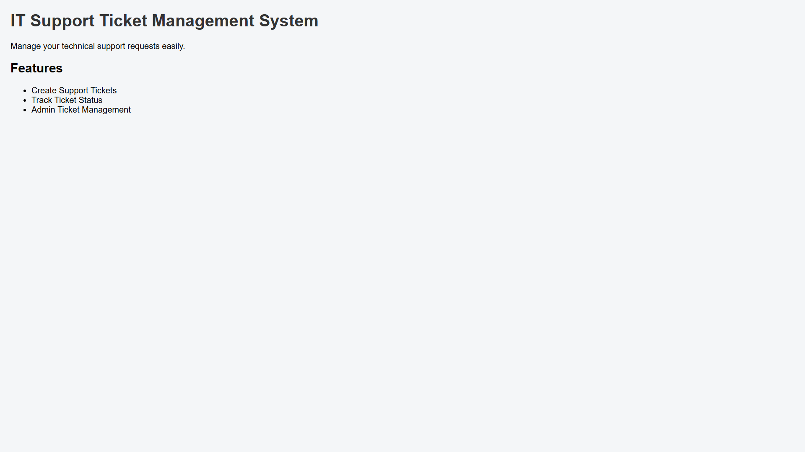

# IT Support Ticket Management System

## Project Overview

IT Support Ticket Management System is a web-based application developed to manage and track technical support requests efficiently.

The system allows users to raise support tickets, track issue status, and helps administrators manage and resolve technical issues.

## Features

- User Registration
- User Login
- Create Support Tickets
- Track Ticket Status
- Admin Dashboard
- Ticket Management
- Issue Resolution

## Technologies Used

- Python
- Flask
- HTML
- CSS
- JavaScript
- SQLite Database

## Project Screenshots

### Home Page



## Project Structure

```text
IT-Support-Ticket-Management-System

├── app.py
├── database.py
├── requirements.txt
├── README.md

├── screenshots
│   └── home-page.png

├── templates
│   ├── index.html
│   ├── login.html
│   ├── register.html
│   ├── dashboard.html
│   ├── create_ticket.html
│   └── admin.html

└── static
    ├── style.css
    └── script.js


Author

Sandhiya R
